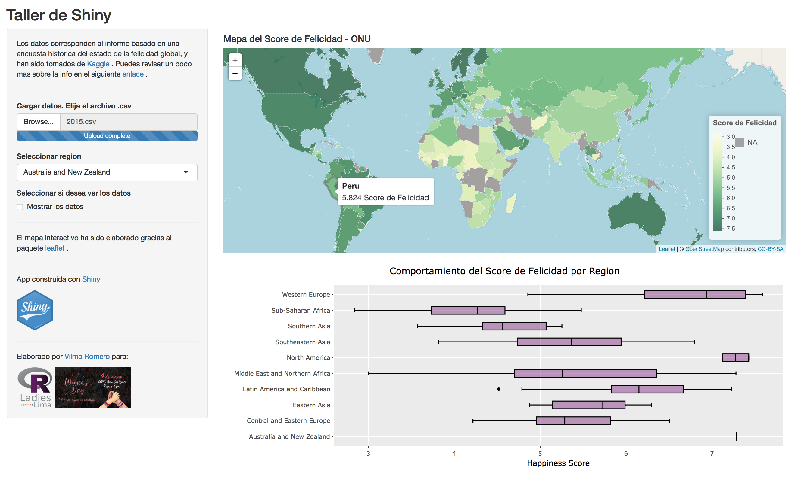

# Women's Day: Por más mujeres en tecnología
***
# *Crea tu primera app en 45 minutos con Shiny y R*
***
## Descripción
Este taller tiene como objetivo introducir a los participantes el uso del paquete **`shiny`**. Este paquete permite construir de manera sencilla aplicaciones web interactivas directamente desde R. Además, gracias a que la elaboración se realiza completamente desde R, se tiene la ventaja de que los usuarios no sólo puedan interactuar con los datos sino también con sus respectivos análisis.

Al finalizar de este taller, habremos construido lo siguiente:



El despliegue de esta aplicación se encuentra en <https://vilsurr.shinyapps.io/tallershinywomensday/>

## Datos
Los datos que se usan para crear esta aplicación están contenidos en la carpeta **"world-happiness-report"** y han sido tomados de la plataforma  [Kaggle](https://www.kaggle.com). La información mostrada está basada en una encuesta histórica del estado de la felicidad global. Si deseas conocer a mayor detalle estos datos, puedes revisar este [enlace](https://www.kaggle.com/unsdsn/world-happiness).

## Paquetes a utilizar
Para que la aplicación puede ejecutarse adecuadamente se necesita tener instalados los siguientes paquetes:

```r
install.packages("shiny")
install.packages("leaflet")
install.packages("rgdal")
install.packages("tidyverse")
install.packages("plotly")
install.packages("DT")
install.packages("htmltools")
```

## Algunas consideraciones
- El archivo principal de construcción es el script **app.R**. 
- Se debe descargar completamente este repositorio y establecerlo como directorio de trabajo antes de ejecutar el script **app.R**. Caso contrario, algunos resultados de la aplicación generarán error.
- La aplicación será creada en el servidor local por defecto. Si deseas que se encuentre en la web, puedes realizar el despliegue haciendo uso de [Shinyapp.io](https://www.shinyapps.io).

## Recursos adicionales

- [**Hoja de referencia de Shiny**](https://www.rstudio.com/resources/cheatsheets/)
- Página oficial de Shiny - [**http://shiny.rstudio.com**](http://shiny.rstudio.com)
- Tutorial oficial de Shiny - [**http://shiny.rstudio.com/tutorial/**](http://shiny.rstudio.com/tutorial/)

